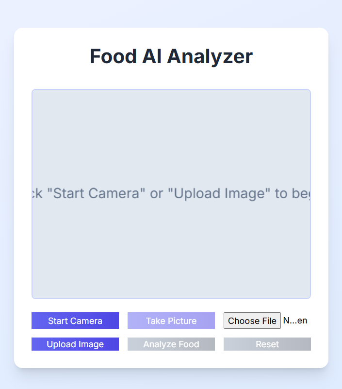
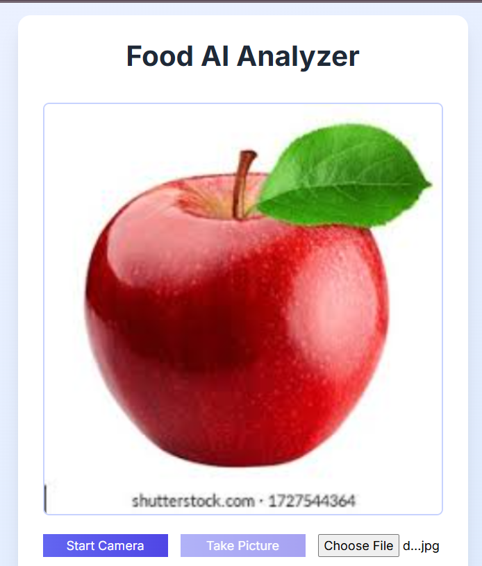
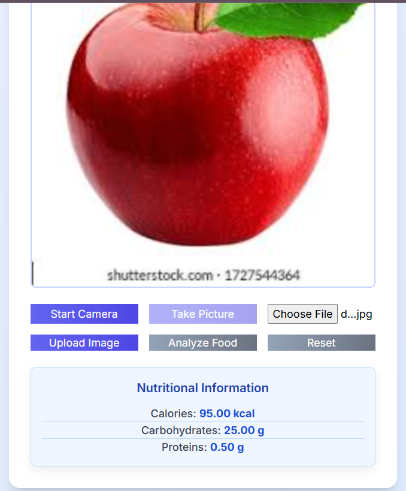

# Food AI Analyzer

  
  
  

## About the Project

The Food AI Analyzer is a web application that provides instant nutritional insights by estimating calorie, carbohydrate, and protein content from food images. It leverages Google's Gemini AI to analyze pictures taken with a device's camera or uploaded from a gallery, making dietary tracking and food education convenient and accessible on any device.

## Features

* **Camera & Upload:** Capture or upload food images.

* **AI Analysis:** Get estimated calories, carbs, and proteins using Google Gemini AI.

* **Responsive UI:** Works well on both mobile and desktop.

## How to Use

1. **Start Camera / Upload Image:** Click to activate your camera or select an image from your device.

2. **Capture / Select:** Take a clear picture or choose your image.

3. **Analyze:** Click "Analyze Food" to get nutritional estimates.

4. **View Results:** See the calorie, carbohydrate, and protein breakdown.

5. **Reset:** Clear the current analysis to start over.

## Installation

### Prerequisites

* Web browser

* Internet connection

* **Google AI API Key** (essential for AI analysis)

### API Key Setup

1. Obtain your API key from [Google AI Studio](https://aistudio.google.com/app/apikey).

2. Open `js/script.js` and replace `const apiKey = "";` with `const apiKey = "YOUR_PASTED_API_KEY_HERE";`.

3. Save the `script.js` file.

### Local Setup

1. **Ensure API Key is Set:** Make sure you have completed the [API Key Setup](#api-key-setup) step.

2. Clone this repository or download the project files.

3. Navigate to the `food-analyzer-app` folder in your terminal.

4. Run `python -m http.server` to start a local server.

5. Open `http://localhost:8000` in your browser.

## Deployment

To make your app accessible from anywhere, use a static site hosting service:

* **Netlify:** Drag and drop your `food-analyzer-app` folder onto [Netlify's dashboard](https://www.netlify.com/).

* **Vercel:** Import your GitHub repository to [Vercel](https://vercel.com/).

* **GitHub Pages:** Push your code to a public GitHub repository and enable Pages in settings.

## File Structure
